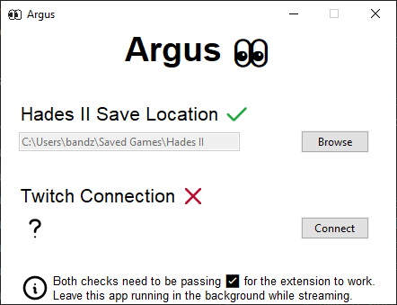
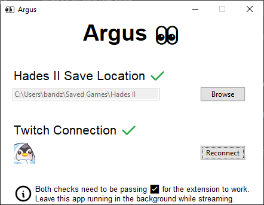

# Argus 👀 (standalone app)

Argus is a standalone app that supports the Argus Twitch extension for `Hades II`. It will show your viewers various details about your run. May chat never ask you about your fear setup ever again. 🎉

## Features

Sends data from your `Hades II` game to Twitch, displaying the following to your viewers:

- Run information (boons, hammers, keepsake, weapon, familiar, ...)
- Arcana loadout
- Fear setup
- Up to three boons pinned in the codex will be shown (with requirements) as targets for this run.

Note that the Twitch overlay will not update instantly when you get a new boon or similar. Argus looks at changes in your active save file. This makes the app 100% unintrusive with relation to the game, but it also means that updates happen more-or-less when you exit a chamber.

See the full list of data that we show to viewers [below](#full-argus-scope).

# Installation instructions

At the moment we support only Windows systems. Linux support is planned for the future. To install on Windows, do the following:

- Go to the [Releases](https://github.com/bmilojkovic/argus-h2-app/releases) section of this repo.
- Download the newest version of the app.
- Follow the installer wizard.

# Setting up after install and testing with Twitch

You can follow the steps below and check if everything is working properly before going live on Twitch. Note that you can start Argus while the game is running as well.

## Argus app setup

- When you run the app for the first time, it will probably look like this:
  
- The `Hades II` save location is normally at `C:\<user profile>\Saved Games\Hades II`. If for some strange reason this is not the case on your machine, you will have to locate the directory yourself.
- The second check should be failing by default. You need to connect your Twitch account to Argus by clicking the `Connect` button. A new tab will open in your browser prompting you to perform the connection. Argus should ask for the minimum information about your account (email, username, profile picture, ...). We actually only need your username and profile picture. This process ensures that streamers can not be impersonated in our system.
- The connection step above needs to be done only once. If you failed to connect your account with Argus and want to retry, you can just click the `Connect` button again when you are ready.
  
- With this the app is ready to go. Remember to leave it running in the background while you are streaming `Hades II`.

## Twitch stream setup

- The next step is to enable the [Argus Twitch extension](https://dashboard.twitch.tv/extensions/sl19e3aebmadlewzt7mxfv3j3llwwv) on your stream. If the link doesn't work, go to `Twitch → Creator Dashboard → Extensions → Discovery`, and find it in the extension search. You do not need to configure anything on the Twitch extension for it to start working. The extension configuration page should confirm that the connection step you did previously was successful.
- To preview the extension, go to your `Stream Manager` tab on Twitch and click on the `👀` icon listed under your `Quick Actions`. A window will pop up that shows you what your viewers will see as an overlay on your stream. If you want to see things changing, just start a `Hades II` run and go through one room. The display on Twitch updates whenever you leave a room while doing a run. Note that it will not update in the Crossroads.

# What Argus doesn't see 🙈

Some notable things are still invisible to Argus and will hopefully be cleared up in the future. Here is a list of several items we assume you expect to have, but we do not support (yet):

- **Pom upgrades.** All boons will be shown as if they have 0 pom upgrades. This means that the numbers on the descriptions will not exactly match the game once your build starts getting juicy.
- **Chaos details.** Argus isn't able to percieve all the randomness that Chaos commands. Chaos curses and boons will be shown in their most basic version, which will almost certainly not match what you have in the game. The description will be correct, but number of rooms and particular numbers / percentages will be off.
- **Consumable items.** Consumable items such as those bought at the Well of Charon are currently invisible to Argus.
- **Path of stars upgrades.** Selene Hexes are fine, but each individual upgrade doesn't seem worth the limited room that we have on the extension UI, so Argus just skips them.
- **Any values that change over time.** Things such as:
  - Remaining healing left on the Ghost Onion Keepsake.
  - Current damage bonus from the Crimson Dress.
  - Number of uses on Moon Water.
  - etc.

We pray to Hera that Argus gains more insight in the near future and with it the ability to see all of these spicy details, and more. 🙏

# Full Argus scope

As a rule-of-thumb: if the information would be contained in a wiki page, we probably have it. Here is a comprehensive list of things currently observable by Argus:

- **Rarities**: Anything that has a rarity we almost certainly have covered. Boons, keepsakes, weapons, arcana cards, etc. will be shown with their respective rarities correctly.
- Panel 1: **Run**
  - Weapon
  - Familiar
  - All boons from all 9 primary Gods
    - Aphrodite
    - Apollo
    - Ares
    - Demeter
    - Hephaestus
    - Hera
    - Hestia
    - Poseidon
    - Zeus
  - Boons / Gifts from:
    - Artemis
    - Hades
    - Arachne
    - Medea
    - Circe
    - Icarus
    - Athena
    - Dionysus
    - Hermes
    - Chaos (including curses)
  - Keepsake
  - Hex
- Panel 2: **Arcana**
  - All currently active Arcana cards with their descriptions, shown in no particular order.
- Panel 3: **Vows of Night**
  - Shown like in the Oath of the Unseen with full descriptions.
- Panel 4: **Pinned boons**
  - Up to three boons pinned in the codex will be shown here as targets for the run. If these boons have requirements, they will be shown as well.

# If you are a developer

Details on how the app does what it does can be found in the [TECH_README](doc/TECH_README.md).

## Making your own build

If you want to make your own build of the app:

- Make sure to install `requirements.txt` in your python virtual environment.
- Run `build.bat`. It will use pyinstaller to make a `dist` folder and a full release inside.
- To make an installer, use [Inno](https://jrsoftware.org/isinfo.php) and `windows_install_script.iss`. Make sure to change the `RepoPath` in that script to wherever this repo is located on your machine. It will make a `release` folder in the repo with the installer.

## Contact

If you have feedback or questions, feel free to contact the original author of this mod at: bandza88@gmail.com or come by the [Twitch stream](https://www.twitch.tv/crazy__penguin) where this mod was originally developed.

## Note on the mod

This app [also exists](https://github.com/bmilojkovic/argus-h2-mod) as a mod for `Hades II`. The mod is now deprecated since this app will probably always be more reliable and faster.

# Credits

- [Hades Saves Extractor](https://github.com/TheNormalnij/Hades-SavesExtractor) by TheNormalnij.
- [Hades II modding community](https://sgg-modding.github.io/Hades2ModWiki/) for general help and discussion.
